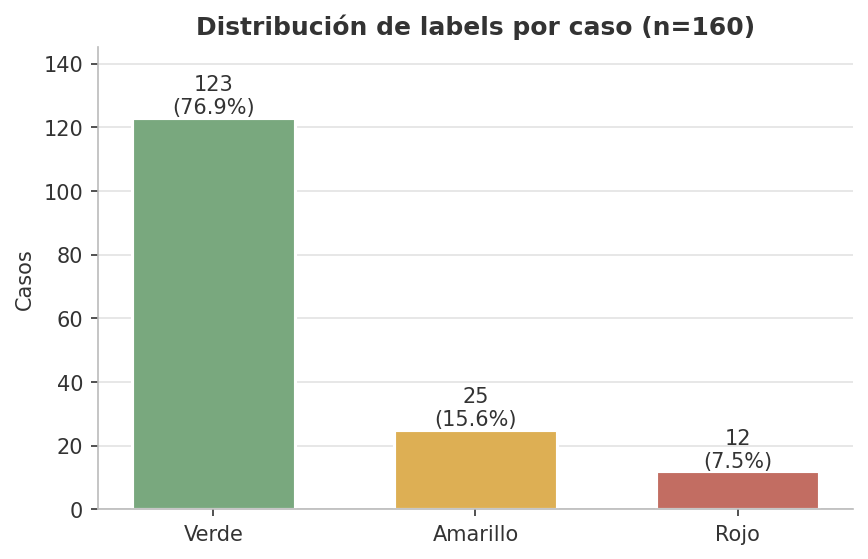
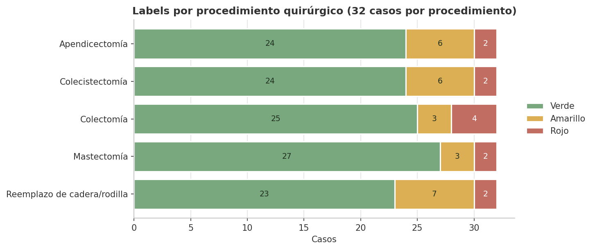
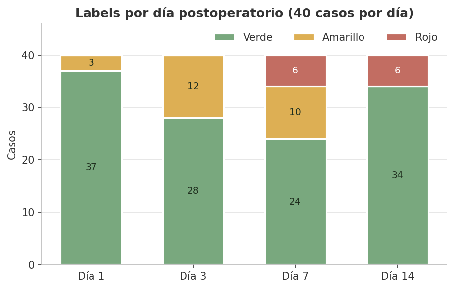
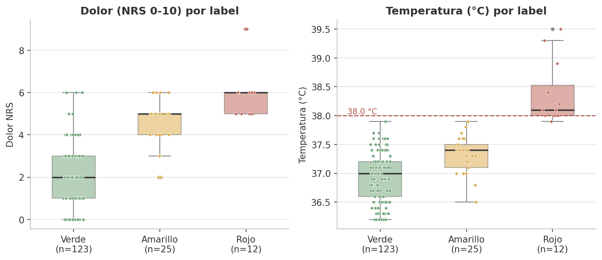
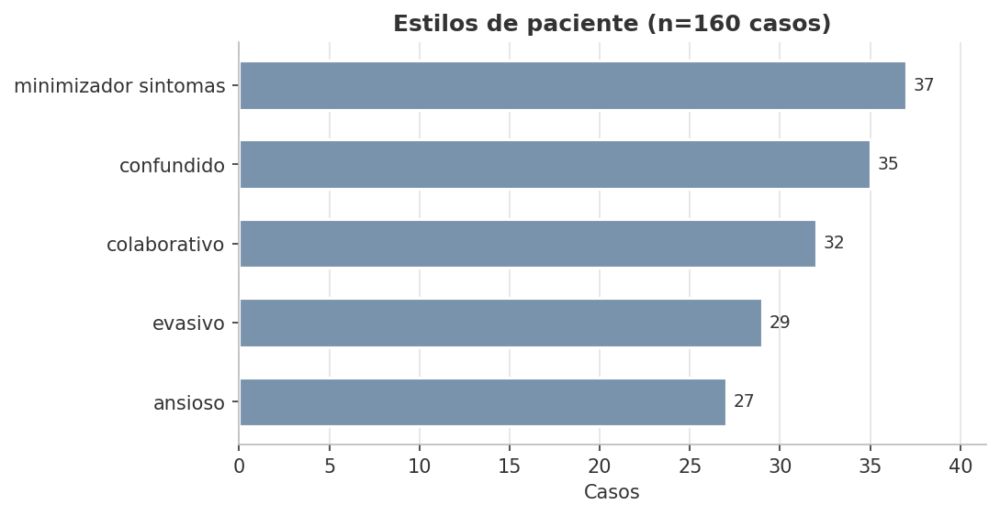
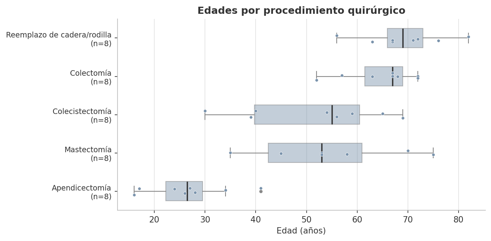

# Análisis exploratorio del dataset (EDA)

Agente de voz de seguimiento postoperatorio — Tech Sphere Challenge 2026.
Todas las cifras de este documento se calculan desde `data/warehouse.db` con
`scripts/analyze_dataset.py`, que además imprime un bloque de verificación con
cada número citado aquí.

## Resumen ejecutivo

El dataset contiene **160 casos** de seguimiento (40 pacientes sintéticos × 4 días
postoperatorios: 1, 3, 7 y 14) y **3.991 turnos** de conversación en dos capas
(1.920 limpios y 2.071 ruidosos). La variable objetivo `label_ground_truth` está
fuertemente desbalanceada: **123 verde (76,9 %), 25 amarillo (15,6 %) y 12 rojo
(7,5 %)**. Las dimensiones clínicas separan bien los extremos: fiebre ≥ 38,0 °C,
secreción purulenta y movilidad incapacitante nueva aparecen **exclusivamente** en
casos rojos, mientras que la tríada dolor ≤ 3 + temperatura < 37,5 °C + herida
normal cubre 79 casos y todos son verdes. El terreno ambiguo es el amarillo, que
se solapa con verde en dolor y temperatura y exige leer señales combinadas
(eritema, apetito y sueño alterados). La capa ruidosa agrega marcadores de ASR
(`[inaudible]`, `[silencio]`) y 151 interrupciones de terceros en 105 casos.

## Metodología ETL

Los cuatro libros de Excel de `dataset/` (turnos de diálogo, trayectorias clínicas
"silver" y perfiles demográficos/clínicos de pacientes) se extraen con pandas, se
tipan y validan de forma defensiva (JSON de comorbilidades y campos de
adaptación parseados y normalizados), se denormalizan en una tabla maestra
`casos` (caso → trayectoria → perfil clínico → demografía, con el JOIN
`caso_id = "caso_" + trayectoria_id`) y se cargan de forma idempotente en el
warehouse SQLite `data/warehouse.db`, junto con las tablas `pacientes`,
`perfiles_clinicos`, `trayectorias` y `turnos`. La carga pasa 7 controles de
calidad automatizados (conteos por dimensión, label constante por caso,
distribución 123/25/12, joins sin huérfanos, JSON válido y suma de turnos por
capa). El detalle del pipeline se documenta en
[docs/arquitectura/etl.md](../arquitectura/etl.md).

## Distribución de la variable objetivo

De los 160 casos, 123 son verdes, 25 amarillos y 12 rojos. La clase que el
sistema no puede permitirse fallar (rojo) es también la más escasa: cualquier
evaluación debe reportar métricas por clase (recall de rojo en particular) y no
exactitud global, que un clasificador trivial "todo verde" ya dejaría en 76,9 %.

## Labels por procedimiento

Cada procedimiento aporta exactamente 32 casos (8 pacientes × 4 días). La mezcla
de labels es similar entre procedimientos: los rojos van de 2 (apendicectomía,
colecistectomía, mastectomía, reemplazo de cadera/rodilla) a 4 (colectomía), y
los amarillos de 3 a 7. Ningún procedimiento es un predictor fuerte del label
por sí solo; el riesgo se concentra en la trayectoria clínica, no en el tipo de
cirugía.

## Labels por día postoperatorio

Cada día tiene 40 casos. El patrón temporal es clínicamente coherente:

- **Día 1:** 37 verde / 3 amarillo / 0 rojo — molestias tempranas esperadas.
- **Día 3:** 28 verde / 12 amarillo / 0 rojo — pico de casos en vigilancia.
- **Día 7:** 24 verde / 10 amarillo / 6 rojo — las complicaciones reales emergen.
- **Día 14:** 34 verde / 0 amarillo / 6 rojo — los casos se polarizan: o el
  paciente se recuperó o la complicación ya es franca.

Implicación directa para el agente: **todos los rojos ocurren en los días 7 y
14**, y el día 14 no tiene zona intermedia — a esa altura una señal anómala debe
pesar más.

## Dolor y temperatura por label

| Métrica | Verde (n=123) | Amarillo (n=25) | Rojo (n=12) |
|---|---|---|---|
| Dolor NRS: mediana [p25–p75] | 2 [1–3] | 5 [4–5] | 6 [5–6] |
| Dolor NRS: rango | 0–6 | 2–6 | 5–9 |
| Temperatura °C: mediana [p25–p75] | 37,0 [36,6–37,2] | 37,4 [37,1–37,5] | 38,1 [38,0–38,5] |
| Temperatura °C: rango | 36,2–37,9 | 36,5–37,9 | 37,9–39,5 |

La temperatura separa el rojo casi perfectamente: 11 de los 12 rojos están en
≥ 38,0 °C y ningún verde o amarillo alcanza los 38,0 °C (máximo 37,9 °C en ambos).
El dolor separa peor: verde y amarillo se solapan entre 2 y 6, y solo dolor ≥ 7
es exclusivo de rojo (2/2 casos). La franja 37,5–37,9 °C no discrimina por sí
sola (15 verde / 7 amarillo / 1 rojo).

## Estilos de paciente

El estilo conversacional es constante dentro de cada caso y está balanceado:
minimizador de síntomas (37 casos), confundido (35), colaborativo (32), evasivo
(29) y ansioso (27). El 41 % de los casos (minimizador + evasivo) tiende a
subreportar o esquivar síntomas, lo que obliga al agente a repreguntar en vez de
aceptar la primera respuesta; el estilo confundido (22 %) exige reformular con
lenguaje simple y confirmar datos como la fecha de cirugía.

## Edades por procedimiento

Edad global: 16–82 años (promedio 53,0; 19 F / 21 M). Los perfiles por
procedimiento son epidemiológicamente plausibles: apendicectomía concentra
pacientes jóvenes (16–41, promedio 26,6), mientras colectomía (52–72, promedio
64,8) y reemplazo de cadera/rodilla (56–82, promedio 69,3) concentran adultos
mayores. Esto importa para el tono del agente (tratamiento de "usted",
acompañantes frecuentes en mayores) y explica la presencia de cuidadores como
terceros en la capa ruidosa.

## Calibración clínica para la lógica de decisión

Números reales del warehouse por dimensión × label (detalle completo en
[figuras/calibracion_dimensiones.csv](./figuras/calibracion_dimensiones.csv)):

| Dimensión | Verde (n=123) | Amarillo (n=25) | Rojo (n=12) |
|---|---|---|---|
| **dolor_nrs** | mediana 2, rango 0–6 | mediana 5, rango 2–6 | mediana 6, rango 5–9 |
| **fiebre_c** | mediana 37,0, rango 36,2–37,9 | mediana 37,4, rango 36,5–37,9 | mediana 38,1, rango 37,9–39,5 |
| **movilidad** | normal 75 / limitada_esperada 48 | normal 16 / limitada_esperada 9 | normal 4 / limitada_esperada 4 / incapacitante_nueva 4 |
| **herida** | normal 112 / eritema_leve 11 | eritema_leve 19 / normal 6 | eritema_leve 9 / secrecion_purulenta 3 |
| **apetito** | normal 93 / levemente_disminuido 25 / muy_disminuido 5 | muy_disminuido 12 / levemente_disminuido 9 / normal 4 | muy_disminuido 12 |
| **sueno** | normal 90 / levemente_alterado 29 / muy_alterado 4 | muy_alterado 16 / normal 5 / levemente_alterado 4 | muy_alterado 12 |

### Umbrales empíricos propuestos para el prompt del agente

Reglas de escalamiento, ordenadas de mayor a menor certeza empírica en estos
160 casos:

1. **Temperatura ≥ 38,0 °C → rojo probable.** Los 11 casos con ≥ 38,0 °C son
   rojos (11/11); el único rojo restante reporta 37,9 °C. Ningún verde ni
   amarillo llega a 38,0 °C.
2. **Herida con secreción purulenta → rojo seguro.** 3/3 casos son rojos.
3. **Movilidad "incapacitante nueva" (no puede moverse y antes podía) → rojo
   seguro.** 4/4 casos son rojos.
4. **Dolor ≥ 7 → rojo probable.** 2/2 casos son rojos; ningún verde/amarillo
   supera 6.
5. **Dolor ≥ 5 → escalar al menos a amarillo.** De 32 casos, 26 son amarillos o
   rojos y solo 6 verdes; además los 12 rojos reportan dolor ≥ 5.
6. **Eritema leve en la herida → nunca cerrar en verde sin revisar el resto.**
   De 39 casos con eritema leve, 28 son amarillos o rojos (72 %); el eritema por
   sí solo no decide, pero descarta el verde automático.
7. **Apetito "muy disminuido" y sueño "muy alterado" acompañan al 100 % de los
   rojos** (12/12 cada uno), aunque también aparecen en amarillos y algunos
   verdes: son señales de refuerzo, necesarias pero no suficientes.
8. **Herida normal → rojo casi descartado.** 0 rojos entre 118 casos con herida
   normal (112 verdes, 6 amarillos).
9. **Tríada tranquilizadora: dolor ≤ 3 + temperatura < 37,5 °C + herida normal →
   verde probable.** 79/79 casos con esa combinación son verdes.

Sesgo recomendado: ante ambigüedad entre amarillo y verde, escalar a amarillo;
ante cualquier regla 1–4, escalar a rojo aunque el paciente minimice (el estilo
"minimizador_sintomas" es el más frecuente del dataset).

## Capa limpia vs capa ruidosa

| Métrica | capa1_limpia | capa2_ruidosa |
|---|---|---|
| Turnos | 1.920 | 2.071 |
| Turnos de agente / paciente | 960 / 960 | 960 / 960 |
| Turnos de tercero (`_c2_tercero`) | 0 | 151 (en 105 de 160 casos) |
| Longitud media del texto (agente) | 126,0 caract. | 127,8 caract. |
| Longitud media del texto (paciente) | 136,8 caract. | 138,4 caract. |
| Longitud media del texto (tercero) | — | 68,8 caract. |
| Longitud mínima de un turno | 24 caract. | 3 caract. (`...`) |
| Turnos con `[inaudible]` | 0 | 129 |
| Turnos `[silencio]` o `...` | 0 | 72 (37 agente, 35 paciente) |

La capa 2 replica los 1.920 turnos de la capa 1 (con sufijo `_c2`) degradándolos
como lo haría un canal telefónico con ASR imperfecto, e inserta 151 turnos de
terceros. Ejemplo real de degradación (`dlg_caso_tray_pac_42_00019_3_1_c2`):

> "¡Ay se- qué pena, es que [inaudible] [inaudible] es- como en un 5, ahí en
> [inaudible] pecho donde me operaron!"

Los terceros usan exactamente **3 plantillas**: "Perdón, soy la hija, él no
escucha muy bien, ¿le puedo ayudar a responder?" (53), "Disculpe, soy el
cuidador, permítame contarle cómo lo he visto estos días." (52) y "Hola, habla
la esposa, él está descansando, yo le cuento." (46). El agente debe manejar el
cambio de interlocutor sin perder el hilo clínico ni asumir que quien responde
es el paciente.

## Implicaciones de diseño

- **Desbalance de clases → sesgo a escalar.** Con 12 rojos sobre 160 casos, el
  costo de un falso verde (complicación no detectada) domina al de un falso
  amarillo. La lógica de decisión y su evaluación deben priorizar el recall de
  rojo; la exactitud global es una métrica engañosa aquí (línea base 76,9 %).
- **El arquetipo de trayectoria es fuga de información para cualquier ML.**
  `arquetipo_trayectoria` casi determina el label: los 12 rojos están en
  `complicacion_real` (12/24 de ese arquetipo), `recuperacion_normal` es 75/76
  verde y `complicacion_leve_vigilancia` no tiene ningún rojo. Es un artefacto
  del generador, no algo observable en producción: no debe usarse como feature
  ni filtrarse al prompt; solo sirve para estratificar particiones de evaluación.
- **Regionalismos colombianos en el habla del paciente.** El NLU y los prompts
  deben tolerar variantes regionales reales del dataset: "pues" aparece en 569
  turnos de paciente, "doctor(a)" como vocativo en 319, "ahorita" en 51,
  "antier" en 34, "mijo/mija" en 28. Ejemplos textuales:
  - "Pues mire, ahorita lo siento como en un 3, algo molesto pero manejable"
    (`dlg_caso_tray_pac_42_00004_7_1`).
  - "¿desde la cirugía de qué día, mija? [...] ya no me acuerdo si fue ayer o
    antier que estuvo peor" (`dlg_caso_tray_pac_42_00003_3_1`).
  - "Bueno mijo, ¿ya casi terminamos? Es que se me está enfriando el caldo"
    (`dlg_caso_tray_pac_42_00013_14_11`).
  - "Sí señora, como bien, con harto apetito" (`dlg_caso_tray_pac_42_00034_7_9`).
  "Ahorita" y expresiones vagas de tiempo ("por ahí", "antier") obligan a anclar
  las respuestas a valores concretos (escala 0–10, temperatura medida) antes de
  clasificar.
- **Los estilos difíciles son mayoría.** Minimizador + evasivo + confundido
  suman 101/160 casos (63 %): el flujo conversacional necesita repreguntas
  dirigidas por dimensión, no un cuestionario lineal.
- **La capa ruidosa es el escenario de despliegue.** Un turno puede ser `...`,
  `[silencio]` o perder palabras clave por `[inaudible]`; el agente debe pedir
  repetición cuando el dato clínico crítico (temperatura, dolor) quede
  ininteligible, en lugar de imputarlo.

## Limitaciones

- **Datos 100 % sintéticos** (Synthea + generación con LLM y adaptación a
  Colombia): las correlaciones clínicas son plausibles pero fueron diseñadas;
  los umbrales de la sección de calibración describen este dataset, no
  epidemiología real, y deben tratarse como calibración del reto, no como
  guía clínica.
- **n = 160 casos y solo 12 rojos:** los soportes de las reglas de escalamiento
  (3/3, 4/4, 11/11) son consistentes pero pequeños; una regla con soporte 3 no
  sobrevive inferencia estadística seria.
- **Ruido y terceros plantillados:** 3 textos fijos de tercero y marcadores de
  ruido regulares hacen la capa 2 más benigna que audio telefónico real.
- **Label constante por caso** (verificado: 0 discrepancias): no hay evolución
  intra-llamada del riesgo, por lo que el dataset no evalúa la detección de
  deterioro dentro de una misma conversación.
- Los cuatro días de corte (1, 3, 7, 14) dejan sin observar las ventanas
  intermedias donde suele iniciar la fiebre postoperatoria.
