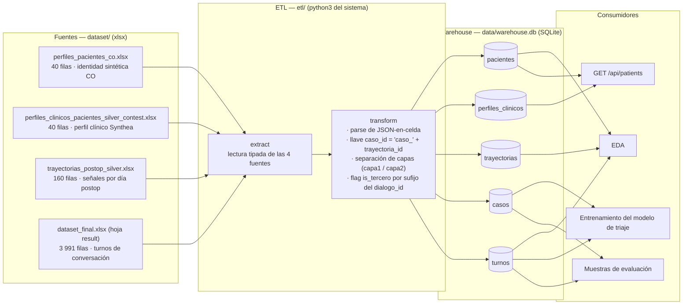

# Arquitectura del ETL

Este documento describe el diseño acordado del pipeline ETL que consolida los cuatro
archivos Excel de `dataset/` en un warehouse SQLite (`data/warehouse.db`). El ETL vive en
`etl/` y se ejecuta con el `python3` del sistema (que dispone de `pandas` y `openpyxl`);
el runtime de la aplicación (`.venv`) no necesita ninguna dependencia de análisis porque
consume el warehouse ya generado mediante el módulo `sqlite3` de la librería estándar.

## Linaje de datos

## Esquema del warehouse

Convenciones: llaves primarias en **negrita**, tipos SQLite. Los campos JSON se almacenan
como `TEXT` ya validados (se garantiza que `json.loads` no falla sobre ningún valor).

### `pacientes`

Fuente: `perfiles_pacientes_co.xlsx` (40 filas). Identidad sintética adaptada a Colombia.

| Columna | Tipo | Descripción |
| --- | --- | --- |
| **paciente_id** | TEXT | Llave primaria. |
| nombre_completo | TEXT | Nombre sintético. |
| direccion | TEXT | Dirección sintética. |
| ciudad | TEXT | Ciudad. |
| departamento | TEXT | Departamento. |
| documento_cc | INTEGER | Cédula sintética. |
| eps | TEXT | EPS asignada. |
| source_country | TEXT | País de origen del perfil Synthea. |
| adapted_country | TEXT | País de adaptación (`CO`). |
| adaptation_fields | TEXT (JSON) | Campos adaptados, JSON validado. |
| adaptation_ts | TEXT | Timestamp de adaptación. |

### `perfiles_clinicos`

Fuente: `perfiles_clinicos_pacientes_silver_contest.xlsx` (40 filas). Relación 1:1 con `pacientes`.

| Columna | Tipo | Descripción |
| --- | --- | --- |
| **paciente_id** | TEXT | Llave primaria y FK → `pacientes.paciente_id`. |
| bundle_id | TEXT | Bundle Synthea de origen. |
| synthea_runtime | TEXT | Versión/runtime de Synthea. |
| modulo_synthea | TEXT | Módulo clínico usado. |
| procedimiento | TEXT | Procedimiento quirúrgico. |
| fecha_cirugia | TEXT | Fecha de la cirugía (ISO-8601). |
| edad | INTEGER | Edad del paciente. |
| genero | TEXT | Género. |
| comorbilidades | TEXT (JSON) | Lista de comorbilidades, JSON validado. |
| n_comorbilidades | INTEGER | Cantidad de comorbilidades, derivada en el transform. |
| complicacion_encounter | INTEGER | 1/0 — si hubo encounter de complicación. |
| generado_ts | TEXT | Timestamp de generación. |

### `trayectorias`

Fuente: `trayectorias_postop_silver.xlsx` (160 filas = 40 pacientes × 4 días). Cada fila es
un paciente-día con sus señales clínicas.

| Columna | Tipo | Descripción |
| --- | --- | --- |
| **trayectoria_id** | TEXT | Llave primaria. |
| paciente_id | TEXT | FK → `pacientes.paciente_id`. |
| dia_postop | INTEGER | Día postoperatorio. |
| arquetipo_trayectoria | TEXT | Arquetipo de evolución. |
| dolor_nrs | INTEGER | Dolor en escala NRS 0–10. |
| fiebre_c | REAL | Temperatura en °C. |
| movilidad | TEXT | Estado de movilidad. |
| herida | TEXT | Estado de la herida. |
| apetito | TEXT | Estado del apetito. |
| sueno | TEXT | Calidad del sueño. |
| seed | INTEGER | Semilla de generación. |
| generado_ts | TEXT | Timestamp de generación. |

### `casos`

Tabla **maestra denormalizada**: una fila por caso clínico evaluable, con la llave
construida `caso_id = "caso_" + trayectoria_id`, la etiqueta de triaje (que en la fuente
viene repetida en cada turno) y todas las señales clínicas y demográficas ya unidas —
`casos` es el punto de entrada único para EDA, entrenamiento del modelo de triaje y
muestras de evaluación, sin que esos consumidores tengan que rehacer los JOIN.

| Columna | Tipo | Descripción |
| --- | --- | --- |
| **caso_id** | TEXT | Llave primaria (`"caso_" + trayectoria_id`). |
| trayectoria_id | TEXT | Referencia a `trayectorias.trayectoria_id`. |
| paciente_id | TEXT | Referencia a `pacientes.paciente_id` (índice `idx_casos_paciente_id`). |
| dia_postop | INTEGER | Día postoperatorio del caso. |
| label_ground_truth | TEXT | `verde` \| `amarillo` \| `rojo`; única por caso (verificada). |
| arquetipo_trayectoria | TEXT | Arquetipo de evolución — **fuga de información hacia el label; excluir como feature del modelo de triaje.** |
| dolor_nrs | INTEGER | Dolor en escala NRS 0–10. |
| fiebre_c | REAL | Temperatura en °C. |
| movilidad | TEXT | Estado de movilidad. |
| herida | TEXT | Estado de la herida. |
| apetito | TEXT | Estado del apetito. |
| sueno | TEXT | Calidad del sueño. |
| procedimiento | TEXT | Procedimiento quirúrgico. |
| fecha_cirugia | TEXT | Fecha de la cirugía. |
| edad | INTEGER | Edad del paciente. |
| genero | TEXT | Género. |
| comorbilidades | TEXT (JSON) | Lista de comorbilidades. |
| n_comorbilidades | INTEGER | Cantidad de comorbilidades. |
| complicacion_encounter | INTEGER | 1/0 — si hubo encounter de complicación. |
| nombre_completo | TEXT | Nombre sintético (uso interno; `GET /api/patients` solo expone el nombre de pila). |
| ciudad | TEXT | Ciudad. |
| departamento | TEXT | Departamento. |
| eps | TEXT | EPS asignada. |

Distribución esperada: 123 verde / 25 amarillo / 12 rojo (160 casos).

### `turnos`

Fuente: `dataset_final.xlsx`, hoja `result` (3 991 filas). Un registro por turno de
conversación. `paciente_id`, `dia_postop` y `label_ground_truth` viven **denormalizados
aquí también** (copiados desde `casos` en el transform, no vía JOIN en tiempo de
consulta) para que los consumidores del turno a turno —EDA, muestras de evaluación— no
necesiten unir contra `casos` en cada consulta. No hay `PRIMARY KEY` declarada sobre
`(dialogo_id, turno_idx)`: la unicidad la garantizan los checks de calidad, no el
esquema; hay índices sobre `caso_id` y `paciente_id`.

| Columna | Tipo | Descripción |
| --- | --- | --- |
| dialogo_id | TEXT | Identificador del turno. Sufijo `_c2` / `_c2_tercero` en capa 2. |
| caso_id | TEXT | Referencia a `casos.caso_id` (índice `idx_turnos_caso_id`). |
| paciente_id | TEXT | Denormalizado desde `casos` (índice `idx_turnos_paciente_id`). |
| dia_postop | INTEGER | Denormalizado desde `casos`. |
| turno_idx | INTEGER | Orden del turno dentro del diálogo. |
| hablante | TEXT | `agente` \| `paciente` \| `tercero` (familiar que interviene en capa 2). |
| texto | TEXT | Contenido del turno. |
| label_ground_truth | TEXT | Denormalizado desde `casos`. |
| estilo_paciente | TEXT | Estilo conversacional simulado. |
| modelo_paciente | TEXT | Modelo generador del rol paciente. |
| modelo_agente | TEXT | Modelo generador del rol agente. |
| capa | TEXT | `capa1_limpia` \| `capa2_ruidosa`. |
| is_tercero | INTEGER | 1 si el `dialogo_id` lleva sufijo `_c2_tercero`; derivado en el transform. |
| generado_ts | TEXT | Timestamp de generación. |

## Checks de calidad

Los 7 checks se ejecutan **después** de cargar el warehouse (`etl/quality.py`, sobre la
conexión SQLite ya escrita) e imprimen un reporte ✓/✗ por check en `scripts/run_etl.py`;
no abortan la carga — un warehouse recién escrito es más fácil de inspeccionar con
`sqlite3` para diagnosticar un fallo que uno que nunca llegó a materializarse. Cada check
responde a una advertencia explícita del propio reto.

| Check | Qué valida | Por qué importa |
| --- | --- | --- |
| `casos_160_en_cada_dimension` | `casos`, `trayectorias` y `turnos` (por `caso_id` distinto) reportan 160. | Detecta filas duplicadas o perdidas en la lectura de Excel. |
| `pacientes_40_en_cada_dimension` | `pacientes`, `perfiles_clinicos`, y `casos`/`turnos` (por `paciente_id` distinto) reportan 40. | Mismo propósito, a nivel paciente. |
| `label_constante_por_caso` | `label_ground_truth` toma exactamente un valor por `caso_id`, tanto en `casos` como en `turnos` (0 discrepancias entre ambas tablas). | La etiqueta es el ground truth del triaje; un caso con etiquetas mezcladas invalidaría el entrenamiento del modelo de triaje sin aviso. |
| `distribucion_labels_123_25_12` | Distribución global = 123 verde / 25 amarillo / 12 rojo. | Confirma que la carga no perdió ni duplicó casos de una clase — crítico dado el desbalance ya extremo. |
| `join_casos_trayectorias_sin_huerfanos` | Anti-join en ambas direcciones entre `casos.caso_id` y `"caso_" + trayectorias.trayectoria_id` = 0 filas huérfanas. | **Advertencia del reto: el join no es directo.** La llave se construye concatenando un prefijo; un desajuste silencioso descartaría casos completos sin error visible. |
| `json_parseado_sin_error` | `json.loads` exitoso sobre el 100 % de `comorbilidades` y `adaptation_fields` ya cargados. | **Advertencia del reto: hay JSON embebido en celdas de texto.** Mejor detectarlo en el ETL que propagar un string inservible al API o al modelo. |
| `turnos_por_capa_suman_3991` | `capa1_limpia` + `capa2_ruidosa` = 3 991. | **Advertencia del reto: ambas capas comparten el mismo `caso_id`.** Confirma que ninguna capa se perdió en la carga; cualquier split train/eval debe hacerse por `caso_id`, nunca por `dialogo_id`, para no filtrar información entre capas. |

## Decisiones de diseño

- **SQLite como warehouse.** Cero servicios que instalar o levantar: el jurado no
  configura ninguna base de datos. Es un único archivo versionable en git, consultable
  desde la aplicación con `sqlite3` de la librería estándar (sin dependencias nuevas en
  el runtime) y desde cualquier herramienta de EDA.
- **Dependencias de análisis separadas en `requirements-dev.txt`.** `pandas` y
  `openpyxl` solo se necesitan para construir el warehouse, no para servir la
  aplicación. `requirements.txt` se mantiene mínimo para proteger la regla del reto de
  levantamiento en ≤ 15 minutos; el ETL corre con el `python3` del sistema, nunca con el
  `.venv` del runtime.
- **Warehouse commiteado ya generado.** `data/warehouse.db` se versiona construido, de
  modo que ni el jurado ni la aplicación ejecutan el ETL: el pipeline queda como proceso
  reproducible de desarrollo, no como paso del despliegue.
- **Tabla `casos` derivada.** La llave construida y la etiqueta de triaje se materializan
  una sola vez, en lugar de repetirse en cada turno: los consumidores (entrenamiento,
  evaluación) leen la etiqueta de un único lugar canónico y los checks pueden detectar
  inconsistencias antes de materializarla.
- **Capas y terceros como columnas explícitas (`capa`, `is_tercero`).** El sufijo del
  `dialogo_id` deja de ser una convención implícita y se convierte en atributos
  consultables, lo que hace trivial filtrar capa limpia vs. ruidosa o excluir turnos de
  terceros en entrenamiento y evaluación.
