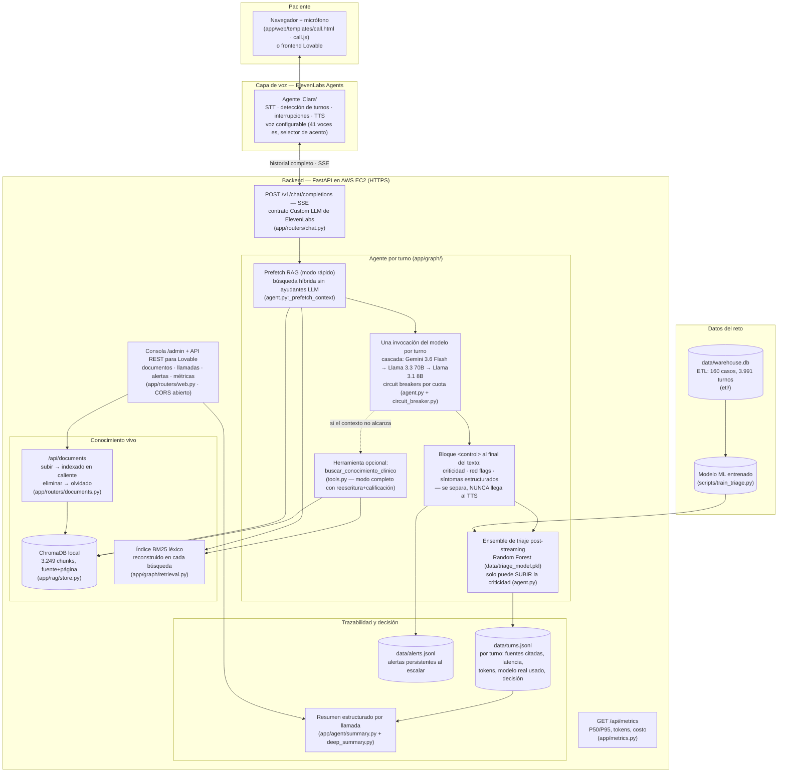
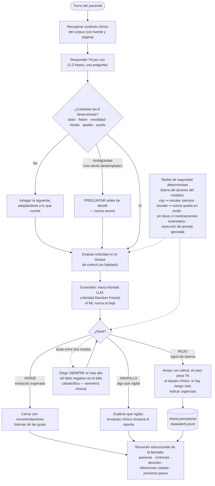
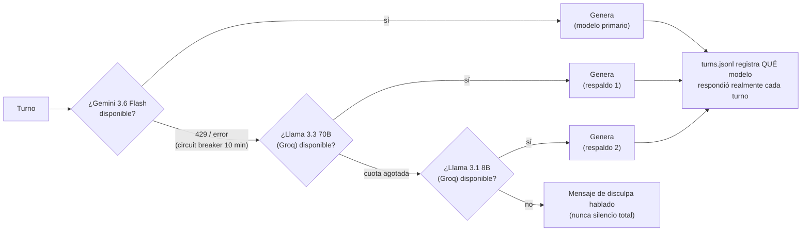

# Entregable 02 — Diagrama de arquitectura y flujo de decisión

Cada elemento de estos diagramas corresponde a un archivo real del repositorio
(indicado entre paréntesis) — el jurado puede tomar cualquier caja y encontrarla
en el código.

## 1. Arquitectura de la solución

## 2. Flujo de decisión del agente

## 3. Cascada de modelos y degradación (todo en nivel gratuito)

