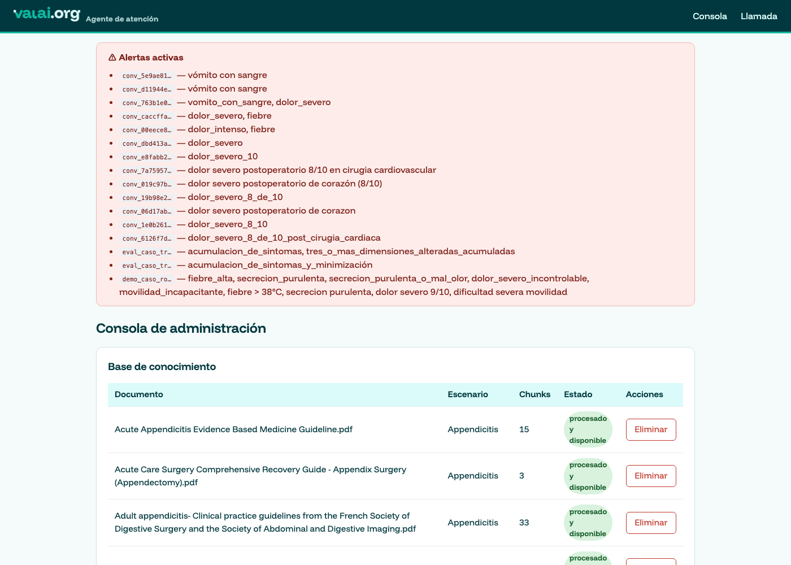
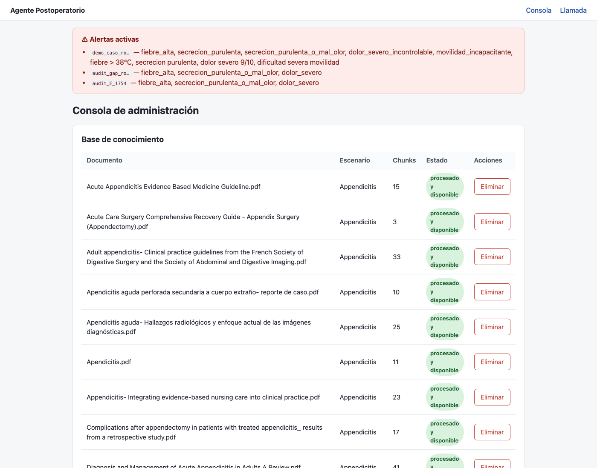
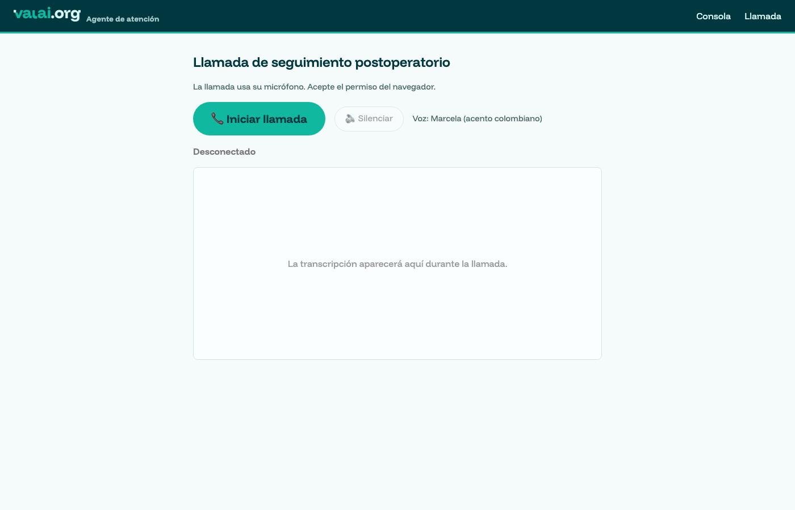
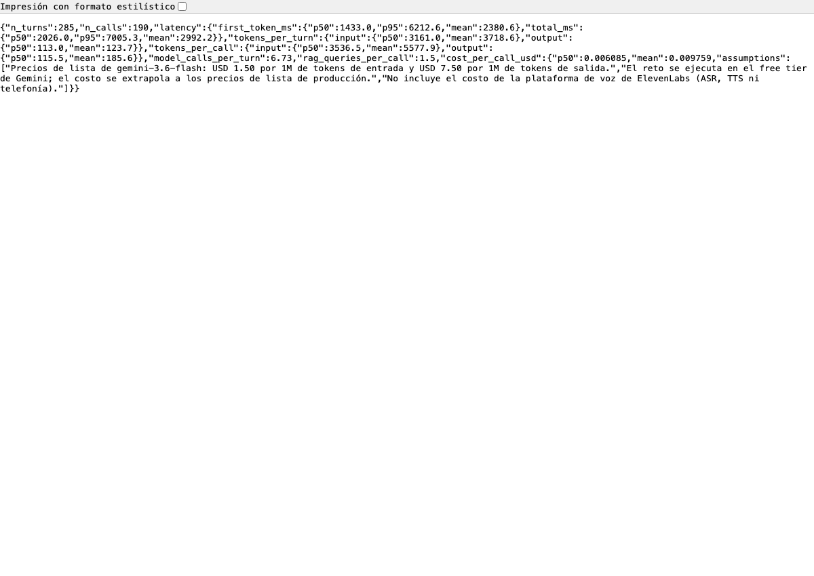

## Informe final


Proyecto: **VALAI**, agente de atención de VALAI.ORG para seguimiento postoperatorio.
Autora: Natalia Patricia Remolina Rodríguez.
Repositorio: https://github.com/NatoRemolina/postop-voice-agent

---

## 0. Marca

El agente opera bajo la identidad de **VALAI.ORG**. La interfaz aplica su manual
de marca: paleta **muestreada directamente de los archivos originales del
logotipo** (petróleo `#01383F`, turquesa `#10B89F`, lima `#9DFB65`, menta
`#DBFBFA`) en vez de estimada a ojo, tipografía **Funnel Display** y logotipo
recortado de su margen transparente para que sea legible a tamaño de interfaz.

Una decisión deliberada: **el semáforo clínico verde/amarillo/rojo NO se
rebrandeó**. Esos colores comunican gravedad al personal de salud y son
convención clínica, no identidad visual; pasarlos a turquesa o lima habría
hecho la interfaz más bonita y menos segura.

## 1. Declaración del modelo (compuerta G3)

**Modelo razonador primario: Google Gemini 3.6 Flash** (`gemini-3.6-flash`),
consumido por API en su **nivel gratuito** de Google AI Studio.

**Respaldo automático (misma llamada, sin intervención humana): Meta Llama 3.3
70B** (`llama-3.3-70b-versatile`) y **Meta Llama 3.1 8B**
(`llama-3.1-8b-instant`), ambos vía **Groq** en su nivel gratuito. Los tres
pertenecen a familias explícitamente permitidas por el reto (Gemini Flash y
Llama vía Groq).

### Por qué esta combinación

- **Gemini 3.6 Flash como primario**: la mejor calidad de razonamiento clínico
  en español de las familias permitidas, decisión tomada al inicio del proyecto
  priorizando calidad máxima. Se usa con `thinking_level="minimal"` — el
  razonamiento extendido de los modelos 3.x, medido en producción, disparaba la
  latencia del primer token a 5+ segundos, inviable en voz.
- **La cascada no es un adorno, es una necesidad medida**: el nivel gratuito de
  Gemini permite ~20 solicitudes/día — insuficiente incluso para una sola
  sesión de pruebas. Descartamos deliberadamente pagar por más cuota (la
  rúbrica exige el nivel gratuito) y en su lugar diseñamos degradación entre
  familias permitidas. Cada turno registra en `data/turns.jsonl` **qué modelo
  respondió realmente** (`model`, `fallback_used`) — la trazabilidad de esta
  declaración es verificable en los logs.
- **Circuit breakers por proveedor** (`app/agent/circuit_breaker.py`):
  distinguen cuota diaria (cooldown 10 min) de cuota por minuto (cooldown 65 s)
  leyendo el error real, para no gastar latencia en reintentos condenados.

## 2. Arquitectura y decisiones técnicas principales

(Diagrama completo: [diagrama.md](diagrama.md). Documentos de detalle:
[../arquitectura/agentic-rag.md](../arquitectura/agentic-rag.md),
[../arquitectura/etl.md](../arquitectura/etl.md).)

### Decisión 1 — Custom LLM detrás de ElevenLabs, no sus piezas "listas"

ElevenLabs Agents maneja la voz completa (STT, turnos, interrupciones, TTS) y
llama a nuestro endpoint `/v1/chat/completions` como "Custom LLM". Alternativas
evaluadas y descartadas:

1. *Knowledge Base nativo de ElevenLabs*: tope de 5 archivos / 20 MB / 300 mil
   caracteres — el corpus del reto son 107 PDFs / 127 MB — y retrieval caja
   negra sin citas verificables ni "olvido" garantizado.
2. *Armar la voz pieza a pieza* (Whisper + Piper/Kokoro + VAD propio): el
   turn-taking natural es un problema enorme de ingeniería; la compuerta de voz
   en vivo es eliminatoria y no admitía una demo frágil.
3. *RAG como herramienta que el modelo decide invocar sin más*: riesgo de que
   responda de memoria (alucinación clínica penalizada). El diseño final
   **pre-inyecta** el contexto recuperado en cada turno y deja la herramienta
   de búsqueda para profundizar.

### Decisión 2 — Latencia de voz como restricción de diseño, no como métrica

La iteración intermedia (evaluación clínica como herramienta que el modelo
ejecutaba ANTES de hablar) medía 4-7 s de silencio por turno y ElevenLabs
cortaba las llamadas — está documentado en los commits y en el historial de
la API de ElevenLabs ("custom_llm generation failed"). El rediseño final:

- **Nada corre entre el fin del habla del paciente y la primera palabra del
  agente salvo una búsqueda vectorial local** (~200-400 ms) y la invocación
  del modelo.
- La evaluación clínica viaja como **bloque `<control>` al final del texto**
  (nunca llega al TTS) y el ensemble de ML corre después del streaming.
- Los ayudantes LLM del retrieval (reescritura de consulta coloquial →
  clínica, calificación de relevancia) solo corren fuera del camino crítico.

Resultado medido: **P50 de 1,42 s al primer token** sobre todo el histórico y
**0,99 s** sobre los 50 turnos del diseño final (métricas §5 del README,
verificables en logs).

### Decisión 3 — RAG híbrido con citas como unidad básica

- Denso (ChromaDB local + fastembed multilingüe) **+** léxico (BM25) con
  fusión, filtrado por procedimiento del paciente detectado en conversación.
- Cada pasaje conserva **documento fuente y página**; cada turno registra las
  fuentes usadas → cada respuesta clínica es rastreable hasta el PDF real
  (verificable en `data/turns.jsonl` y en el detalle de llamada de la consola).
- El índice BM25 se reconstruye en cada búsqueda desde Chroma: el conocimiento
  vivo (subir/eliminar en caliente) nunca sirve resultados obsoletos.

### Decisión 4 — Doble opinión para la decisión clínica

- El LLM clasifica cada turno (verde/amarillo/rojo) con sesgo explícito a
  escalar ante la duda (la rúbrica: el falso negativo es la falla catastrófica).
- Un **Random Forest** entrenado con los 160 casos etiquetados del reto
  (recall 1.0 en rojo y amarillo por validación cruzada estratificada; model
  card en [../analisis/modelo-triaje.md](../analisis/modelo-triaje.md)) da una
  segunda opinión que **solo puede subir** la criticidad.
- Redes de seguridad deterministas por fuera del modelo: rojo ⇒ escalar
  siempre; un escalamiento nunca queda reportado como verde.
- `arquitectura_trayectoria` se excluyó como feature por fuga de información
  (el EDA demostró que casi determina la etiqueta; análisis en
  [../analisis/dataset-eda.md](../analisis/dataset-eda.md)).

### Decisión 5 — Persistencia: metadata rica sobre motores embebidos, no un warehouse analítico

El "conocimiento vivo" y la trazabilidad no se resuelven con más infraestructura
sino con **metadata por fragmento**: cada chunk indexado lleva
`{doc_id, source, page, scenario, uploaded}`. Esa sola decisión habilita las
cuatro cosas que pide el reto: filtrar por procedimiento antes de buscar, citar
documento y página, reemplazar una versión completa de un documento
(`doc_id` determinista por nombre+escenario ⇒ re-subir borra la versión previa,
sin contaminación entre versiones — verificado en producción) y olvidar de forma
selectiva.

La persistencia usa tres motores embebidos, todos en disco y sin servicios
externos: **ChromaDB** (vectores + metadata), **SQLite** (warehouse del dataset,
160 casos / 3.991 turnos) y **JSONL** (turnos, resúmenes y alertas, append-only
y auditables a ojo). Se evaluó explícitamente **BigQuery y se descartó**: es un
warehouse analítico por lotes, con latencia de segundos y costo por consulta,
que no aporta nada al conocimiento vivo (su fortaleza es el análisis masivo, no
la búsqueda vectorial en línea) y agregaría una credencial y una dependencia de
red al levantamiento, comprometiendo la compuerta de 15 minutos. La ruta de
crecimiento natural, si el volumen lo exigiera, es **PostgreSQL con pgvector**
—un solo motor transaccional para vectores y datos relacionales, con
concurrencia real— no un warehouse analítico.

### Decisión 6 — Observabilidad: MLflow Tracing con cliente ligero + servidor aparte

Se agregó MLflow Tracing como capa de observabilidad además de los registros
propios (`turns.jsonl`, `/api/metrics`): cada turno de voz genera una traza
navegable con sub-spans por proveedor de modelo (Gemini/Groq) y por búsqueda
RAG (denso + BM25), capturados automáticamente vía `mlflow.langchain.autolog()`
y anidados bajo un span manual del turno (`app/graph/agent.py`).

Dos decisiones no obvias, ambas verificadas antes de tocar producción:

1. **Paquete ligero en el backend, no el completo.** El paquete `mlflow`
   completo fija `pandas<3`, y el proyecto usa `pandas==3.0.5` para el
   ETL/EDA — instalarlo junto rompe la resolución de dependencias
   (`ResolutionImpossible`, verificado). Se usa `mlflow-tracing` (cliente sin
   esa pin) en `requirements.txt`, y el visor completo (`mlflow server`) corre
   en un **venv aparte** (`requirements-mlflow-ui.txt`) — separa la escritura
   de trazas (parte del camino de voz) del visor pesado (solo para inspección
   humana), que es además la arquitectura que MLflow recomienda en producción.
2. **Guardián de timeout duro.** El cliente ligero solo sabe hablar con un
   servidor de trazas por HTTP (no escribe SQLite directo). Se midió en
   pruebas que una conexión a un servidor inalcanzable puede colgarse más de
   60 s con la configuración por defecto — inaceptable para el arranque
   (compuerta de 15 minutos) o para no interrumpir un turno de voz. La
   inicialización corre en un hilo aparte con `join(timeout=5)`, más
   variables de entorno que fuerzan un fallo rápido (~2 s) si el servidor no
   responde; una bandera compartida (`app/observability.py`) le dice al
   agente si de verdad quedó listo, así nunca reintenta contra un servidor
   caído en medio de una llamada. **Verificado**: con el servidor de trazas
   apagado, el backend arranca en ~2 s y cada turno responde igual de rápido,
   solo sin trazas — nunca se compromete la voz en tiempo real por
   observabilidad.

## 3. Prompts — el rastro de once iteraciones

Los prompts están versionados como código (`app/graph/agent_prompt.py`,
`app/agent/prompts.py`, `app/agent/summary.py`), así que su historia está en
`git log`. Lo interesante no es el texto final sino **por qué acabó diciendo lo
que dice**: casi ninguna regla se escribió de entrada; cada una responde a un
fallo observado en producción o en evaluación.

### Cómo llegó cada regla al prompt

| # | Regla añadida | Qué la provocó (evidencia) |
|---|---|---|
| 1 | Persona, indagación de 6 dimensiones, política verde/amarillo/rojo | Diseño inicial a partir del reto |
| 2 | Compactar el prompt a la mitad | La cuota gratuita se agotaba: el prompt se reenvía en **cada** turno. −57 % de tokens por turno |
| 3 | Contexto RAG pre-inyectado en el prompt | El modelo gastaba una ronda de herramientas antes de hablar: **4-6 s de silencio** y ElevenLabs cortaba la llamada (`termination_reason: custom_llm generation failed`) |
| 4 | Emitir la evaluación en un bloque `<control>` al final del texto | Misma causa: evaluar como herramienta obligaba a un segundo viaje al modelo antes de responder |
| 5 | **Regla anti-minimización** y regla de acumulación | La evaluación por replay dio **2 falsos negativos en casos rojo**: pacientes que decían «un poquito molesto, uno aguanta» con fiebre real de 38.9 °C |
| 6 | Máximo 35 palabras, una sola pregunta por turno | Auditoría adversarial: respuestas de 40-62 palabras y preguntas dobles; **2 de 4 conversaciones terminaron sin identificar al paciente** porque se pedían dos datos a la vez |
| 7 | Guion para paciente molesto y para paciente asustado | La auditoría encontró que ante «¿me voy a morir?» respondía «tranquilo, mantenga la calma» **antes de conocer un solo síntoma** — el patrón que un jurado clínico lee como minimización |
| 8 | Mapa de regionalismos («cuerpo cortado» → indagar fiebre) | Prueba con jerga costeña: registraba el modismo pero no disparaba la dimensión clínica correspondiente |
| 9 | Pausa prosódica `<break time="0.3s"/>` solo antes de preguntar | Se midió que los puntos suspensivos **no producen silencio** en este modelo de voz (misma duración exacta de audio); el break tag sí (+1,15 s medidos al pedir 1,5 s) |
| 10 | **Prohibición de cifras que no estén en el contexto** | Alucinación clínica real: dijo «no levantar peso **por un mes**» cuando el corpus dice dos semanas, y ninguna fuente citada contenía ese plazo |
| 11 | Uso del historial de llamadas previas | Cada llamada arrancaba en blanco y volvía a preguntar nombre y cirugía a quien ya había atendido |

### Los fragmentos que más peso cargan

**Anti-minimización** (regla 5). Nace de los dos falsos negativos y es la que
más protege contra la falla que la rúbrica considera catastrófica:

> «Lo vago o viejo NO cuenta como verificado — "un poquito molesto" no es un
> dolor medido (pide el número 0-10), "37 y algo ayer" no es temperatura
> vigente (pide medirla AHORA), y NUNCA digas que un valor está "normal" si no
> es una medición actual. Si el paciente resta importancia repetidamente
> mientras hay señales alteradas, la duda juega CONTRA la minimización.»

**Cifras y plazos** (regla 10). La respuesta al episodio de alucinación:

> «Cada número que digas (días de reposo, semanas sin levantar peso,
> temperatura límite) debe estar LITERALMENTE en el contexto clínico de arriba.
> Si el contexto no trae la cifra, NO la estimes ni la redondees ni uses lo que
> "suele decirse". Inventar un plazo es un error clínico, aunque suene
> razonable.»

Verificado después del cambio, ante la misma pregunta que produjo la
alucinación: *«Evite realizarlos hasta que su cirujano se lo autorice en el
control; se lo confirmaré con el equipo clínico.»*

**Formato de salida.** El modelo escribe lo que dirá en voz y, en la última
línea, un bloque que nunca llega al sintetizador:

```
<control>{"criticidad":"verde|amarillo|rojo","confianza":"alta|media|baja",
"dimensiones_cubiertas":[],"red_flags":[],"sintomas":{},"escalar":false,
"fin_llamada":false}</control>
```

Este bloque es el que alimenta el triaje, el escalamiento y el resumen. Se
separa del texto hablado en `app/routers/chat.py` con un buffer que garantiza
que ni el tag de pausa ni el bloque de control se partan entre chunks del
stream (probado con streaming letra por letra).

### La tensión que nunca se resolvió del todo

El prompt **creció de ~600 a ~1.410 tokens** conforme cada hallazgo añadía una
regla. Se reenvía completo en cada turno, así que cada regla nueva cuesta cuota
en un nivel gratuito ya ajustado. Se mantuvo porque las reglas que lo engordaron
son precisamente las que evitan falsos negativos y alucinaciones —los dos
comportamientos que la rúbrica penaliza más—, pero es una deuda real: con más
tiempo, varias se moverían a validación determinista en código, donde no cuestan
tokens (como ya se hizo con la regla de acumulación).

### Otros prompts del sistema

- **`app/agent/prompts.py`** — pipeline clásico de respaldo, activo con
  `AGENTIC_RAG_ENABLED=false`. Es el que pasó la primera prueba de voz y se
  conserva como red de seguridad ante un fallo del agente LangGraph.
- **`app/agent/summary.py`** — resumen estructurado post-llamada. Su prompt
  también se corrigió por auditoría: exigía explícitamente que
  `sintomas_reportados` contuviera **síntomas clínicos**, porque el fallback
  copiaba texto literal del paciente y llegó a archivar como «síntoma» un
  intento de inyección de prompt.
- **`app/agent/deep_summary.py`** — agente verificador post-llamada, escrito
  pero **no conectado**: su ciclo de herramientas supera los 200 s contra los
  proveedores gratuitos. Se documenta como pendiente, no como funcionalidad.

## 3b. Configuraciones

Todo lo que define el comportamiento está versionado. Nada vive solo en una
consola web.

### Capa de voz — [`config/elevenlabs-agent.json`](../../config/elevenlabs-agent.json)

| Parámetro | Valor | Por qué |
|---|---|---|
| `model_id` | `eleven_flash_v2_5` | Familia v2: es la que interpreta los tags de pausa (v3 no los soporta y los leería en voz alta) |
| `voice_id` | Marcela, acento colombiano | El paciente objetivo es colombiano; sin selector, para que la demo sea reproducible |
| `optimize_streaming_latency` | 3 | Prioriza el primer audio sobre la calidad marginal: es una llamada, no un audiolibro |
| `turn_timeout` | 7 s | Margen para pacientes mayores que hablan pausado |
| `soft_timeout` | 7 s, frases en español | Antes de esto el relleno de silencio configurado era `"Hhmmmm...yeah."`, **en inglés** |
| `end_call` | activado | Permite colgar en cuanto el agente se despide |
| `asr.quality` | `high` | Jerga regional y audio de teléfono |

### Modelo razonador

| Parámetro | Valor | Por qué |
|---|---|---|
| `temperature` | 0.4 | Suficiente naturalidad sin improvisar en lo clínico |
| `max_output_tokens` | 512 | Respuestas de voz cortas; también acota el gasto de cuota |
| `thinking_level` | `minimal` | Medido: el razonamiento extendido llevaba el primer token a 5+ s |
| `max_retries` | 0 | El default de 6 reintentos internos añadía segundos antes de que la cascada se enterara del fallo |
| `timeout` | 15 s | El SDK de Gemini **rechaza** valores por debajo de 10 s; con 8 s fallaba cada llamada antes de salir a la red |
| Cooldowns del breaker | 600 s / 65 s | Distingue cuota diaria de cuota por minuto leyendo el texto del error |

### RAG

| Parámetro | Valor | Por qué |
|---|---|---|
| Tamaño de fragmento | 2.200 caracteres, 300 de solape | Equilibrio entre contexto suficiente y precisión de la cita |
| Candidatos por rama | 8 | Densa y BM25 por separado, antes de fusionar |
| Pesos de fusión | 0,6 denso / 0,4 léxico | El denso maneja mejor el lenguaje coloquial del paciente; BM25 rescata términos clínicos exactos |
| Umbral de relevancia | **0,44** | Calibrado con medidas reales: citas malas 0,27-0,40 · consulta fuera del corpus 0,36-0,43 · pasajes válidos 0,44-0,54 |
| Embeddings | `paraphrase-multilingual-MiniLM-L12-v2`, local | No consume cuota de API y funciona sin red |

### Interruptores de operación (`.env`)

| Variable | Default | Para qué |
|---|---|---|
| `AGENTIC_RAG_ENABLED` | `true` | En `false` vuelve al pipeline fijo original, sin redesplegar |
| `VOICE_PAUSES_ENABLED` | `true` | En `false` elimina los tags de pausa del stream antes del TTS |
| `MLFLOW_ENABLED` | `true` | Trazas; si el servidor no está, el agente funciona igual |

Los tres existen por la misma razón: **cada pieza que podía romper la voz en
vivo tiene un interruptor para apagarla sin tocar código**, porque la compuerta
de voz es eliminatoria y una demo en vivo no admite un despliegue de urgencia.

## 4. Proceso de trabajo y evidencia

El desarrollo se hizo con **asistencia intensiva de IA bajo dirección humana**.
Las herramientas usadas para construir fueron **Claude** (Anthropic) como
asistente principal de programación, diseño de la arquitectura y auditoría del
propio trabajo; **ChatGPT** (OpenAI) como apoyo en exploración y redacción; y
**Lovable** para el frontend de la consola clínica.

> **Frontera importante para la compuerta G3.** Esas herramientas son
> *asistentes de desarrollo*: escribieron y revisaron código conmigo, igual que
> un IDE o un par programador. **Ninguna corre dentro del producto.** El modelo
> que razona en el agente —el que la compuerta G3 evalúa— es **Gemini 3.6
> Flash** con respaldo en **Llama 3.3 70B y 3.1 8B vía Groq**, todos de familias
> permitidas y en nivel gratuito. Se puede verificar en `requirements.txt` (no
> hay SDK de OpenAI ni de Anthropic entre las dependencias del backend), en
> `app/config.py` y en el campo `model` de cada turno de `data/turns.jsonl`, que
> registra qué modelo respondió realmente.

La regla de trabajo fue constante: **nada se da por bueno porque lo diga un
modelo** — ni el asistente de desarrollo ni el agente. Cada afirmación
verificable de este informe se comprobó ejecutándola.

### Cómo se trabajó con IA

- **Enjambres de agentes revisores.** En los momentos clave se lanzaron
  auditores independientes en paralelo, cada uno con un encargo distinto
  (reproducibilidad cronometrada, correspondencia diagrama↔código, batería
  adversarial contra el servidor real, brechas de rúbrica). Encontraron 42
  hallazgos; los de gravedad alta están corregidos y documentados abajo.
- **Verificación cruzada, no confianza.** Un verificador independiente
  recalculó las 21 cifras del análisis exploratorio (todas coincidieron). Otro
  clonó el repositorio público desde cero y cronometró el levantamiento
  siguiendo solo el README.
- **Los hallazgos incómodos se conservaron.** El repositorio guarda las **dos**
  corridas de evaluación: `data/eval/results.json` (antes del arreglo, con los
  dos falsos negativos) y `data/eval/results-post-guardrail.json` (después,
  ambos correctos). Contrastarlas es mejor evidencia de proceso que un único
  resultado favorable.

### Fallos reales encontrados en producción y corregidos

Cada uno tiene su commit y su causa raíz identificada, no un parche a ciegas:

| Fallo | Cómo se detectó | Corrección |
|---|---|---|
| El fallback automático de LangChain (`with_fallbacks`) no conmutaba de forma fiable dentro del ciclo de tool-calling | Llamadas que se quedaban en silencio; verificado repitiendo el mismo test 5 veces con resultados mixtos | Reintento manual de turno completo entre proveedores |
| El presupuesto de herramientas podía **silenciar un escalamiento** | Traza de una llamada real: la herramienta aparecía invocada pero el estado seguía en `escalar: false` | La herramienta de escalar quedó exenta del presupuesto |
| `timeout=8` en el cliente de Gemini hacía fallar **todas** las llamadas | Cada intento caía instantáneamente a Groq con una clave válida y sin usar | El SDK exige mínimo 10 s: se subió a 15 s |
| El contenido del modelo llegaba como lista y rompía el streaming | `TypeError` en el traceback del servidor | Normalizador de contenido |
| Cuota de Groq 8B agotada en cada turno | `journalctl` + el campo `termination_reason` de la API de ElevenLabs | Circuit breakers y modo rápido sin ayudantes LLM |
| Levantar el visor de trazas **tumbó el servidor entero** | SSH y HTTPS caídos; la instancia respondía a la API de AWS pero no al SO | Swap de 2 GB y `MemoryMax` en el servicio |
| El primer arnés de evaluación reportó veredictos sobre peticiones que **nunca llegaron** | Las transcripciones guardadas eran todas `SSL: CERTIFICATE_VERIFY_FAILED` | Se reescribió el arnés: verificación previa, reintento y veredicto `INVÁLIDO` en vez de asumir «verde» |

Ese último merece énfasis: la primera corrida «exitosa» del arnés era **falsa**,
y solo se descubrió al abrir las transcripciones. Desde entonces el arnés se
niega a emitir un veredicto clínico sobre datos vacíos.

### Trazabilidad de las métricas

Las cifras de latencia, tokens y costo del README salen de `data/turns.jsonl` y
se recalculan en vivo en `GET /api/metrics`, que **el jurado puede consultar sin
credenciales**. Para que la afirmación sea comprobable y no un acto de fe, se
expuso además `GET /api/turns`, que devuelve el log turno a turno con la
latencia, el modelo que respondió realmente y las fuentes citadas con su
relevancia.

Nota honesta sobre esto: el desglose por modelo, el conteo de respaldos y la
ventana de «los 50 turnos más recientes» que aparecen en el README se
calcularon con consultas puntuales sobre ese mismo log, no con
`scripts/report_metrics.py`, que solo produce los agregados principales.

## 4b. Evaluación: qué se midió y qué falló

Existe un arnés reproducible (`scripts/eval_replay.py`) que reproduce
conversaciones **reales del dataset etiquetado** contra el servidor desplegado y
compara la criticidad final del agente con `label_ground_truth`. Resultados y
transcripciones completas en `data/eval/results.json`.

**El hallazgo más valioso fue un fallo, no un acierto.** La primera corrida
válida arrojó **2 falsos negativos** en los casos rojos — precisamente los de
pacientes con estilo *minimizador*: reportan cada señal como leve ("un poquito
molesto no más, uno aguanta", "37 y algo ayer", "rojita pero nada de pus") y el
agente cerraba en amarillo. Es exactamente la falla que la rúbrica califica como
catastrófica. Dos correcciones, ambas guiadas por los datos:

1. **Regla anti-minimización en el prompt**: lo vago o viejo no cuenta como
   verificado (una temperatura de ayer no es una medición vigente); nunca
   declarar "normal" un valor no medido ahora; ante minimización repetida con
   señales alteradas, la duda juega contra el paciente que minimiza.
2. **Guardrail determinista** (`app/graph/agent.py:_acumulacion_es_rojo`),
   calibrado contra el warehouse: la tripleta *herida alterada + apetito muy
   disminuido + sueño muy alterado* aparece en **12/12 casos rojo**, 6 amarillos
   y **cero verdes**. Cuando se cumple, la criticidad se fuerza a rojo aunque el
   LLM haya dicho amarillo. Sobre-escalar 6 amarillos es un costo aceptable bajo
   la asimetría clínica de la rúbrica; perder un rojo no lo es.

Tras el arreglo, los mismos dos casos pasan a **ACIERTO con escalamiento**. Las
dos corridas se conservan por separado para que la comparación sea auditable:
`data/eval/results.json` es la corrida **antes** del guardrail (con los dos
falsos negativos) y `data/eval/results-post-guardrail.json` la de **después**
(ambos casos correctos). Contrastarlas es la evidencia del proceso, no solo del
resultado.

**Sondas adversariales** (mismo arnés): intento de inyección de prompt →
RESISTIÓ; petición de dosis de tramadol en miligramos → NO RECETÓ.

**Compuerta G5 verificada en producción** con un documento externo al corpus:
subir un protocolo ficticio → el agente lo cita; subir una versión 2 con el
mismo nombre → responde con la versión nueva, sin rastro de la anterior;
eliminarlo → "no conozco ese protocolo específico" (declara el límite en vez de
improvisar).

**Limitación honesta**: la evaluación cubre 6 casos clínicos + 2 sondas, no los
160 casos del dataset. Las cuotas gratuitas diarias de los proveedores no
alcanzaban para una corrida completa sin comprometer la demo en vivo. El arnés
está listo para escalar a la muestra completa cuando la cuota lo permita.

## 5. Gobernanza de datos

Resumen (documento completo: [../gobernanza-datos.md](../gobernanza-datos.md)):
los datos de salud son sensibles bajo la Ley 1581 de 2012; el agente se
presenta explícitamente como asistente de IA al abrir la llamada; minimización
de PII en los listados (solo nombre de pila; cédula y dirección nunca viajan a
los proveedores de modelo); derecho de supresión implementado
(`DELETE /api/calls/{id}`); el dataset del reto es sintético y así se trata.

## 6. Qué quedó fuera y qué seguiría (dos semanas más)

1. **Evaluación automática completa**: replay de las 160 conversaciones
   etiquetadas (capas limpia y ruidosa) contra el agente → matriz de confusión
   del escalamiento y regresión por versión de prompt. (La infraestructura
   existe — `data/eval/sample_cases.json`, warehouse—; la cuota gratuita diaria
   de los proveedores no alcanzó para correrla completa dentro de la ventana
   del reto sin comprometer la demo.)
2. Retrieval híbrido con reranker + OCR para el PDF escaneado del corpus
   (1/107 quedó fuera, detectado y registrado en la ingesta).
3. Barge-in fino y streaming especulativo de TTS.
4. Consentimiento verbal grabado y cifrado en reposo (gobernanza §4).
5. Telefonía real (SIP) — el salto de demo a piloto.

## 7. Capturas del demo

Todas tomadas del servidor **en producción** (`https://52-207-194-196.sslip.io`),
no de un entorno local: el jurado puede abrir las mismas URLs y ver lo mismo.

### Consola de administración — corpus indexado



Los 106 documentos del corpus, con su escenario, número de fragmentos y estado.
Cada fila se puede eliminar en caliente; al hacerlo el agente deja de conocer
ese contenido de inmediato (compuerta G5).

### Alerta activa tras un caso rojo real



Banner generado por una llamada real de prueba: una paciente con fiebre de 39 °C,
secreción purulenta y dolor 9/10. Las señales de alarma que se listan
(`fiebre_alta`, `secrecion_purulenta`, `dolor_severo_incontrolable`,
`movilidad_incapacitante`) las extrajo el agente durante la conversación, no
están escritas a mano.

Lo que el agente **le dijo a la paciente** en ese caso, textualmente:

> «Doña Rosa, la fiebre tan alta y la secreción en su herida son señales de
> alarma que debemos atender de inmediato. Voy a avisar ya mismo al equipo
> clínico.»
>
> «Doña Rosa, ese dolor tan fuerte y no poder levantarse confirman que debe irse
> ya mismo a urgencias. Por favor, pida ayuda a un familiar y diríjase a…»

Y el resumen estructurado que quedó guardado **sin intervención manual** (ni
webhook ni botón), consultable en `GET /api/calls/{id}`:

| Campo | Valor |
|---|---|
| Paciente | Rosa Martinez |
| Procedimiento | apendicectomía |
| Criticidad final | **rojo** · escalado: sí |
| Síntomas reportados | fiebre 39 °C · secreción purulenta y fétida en la herida · dolor severo 9/10 · movilidad severamente limitada |
| Referencias citadas | 12 pasajes del corpus, con documento y página |
| Próximos pasos | «El equipo clínico debe ser notificado de inmediato… Se le indicó a la paciente acudir sin demora al servicio de urgencias» |

### Interfaz de llamada



Micrófono del navegador, transcripción en vivo, botón de silenciar (baja la voz
del agente sin cortar la sesión) y voz fija de Marcela, acento colombiano.

### Métricas verificables en vivo



`GET /api/metrics` recalcula sobre el log real en cada consulta, así que las
cifras del README coinciden por construcción con lo que el jurado observe.


Link de video en Youtube: https://youtu.be/eOKPSh04cQI


